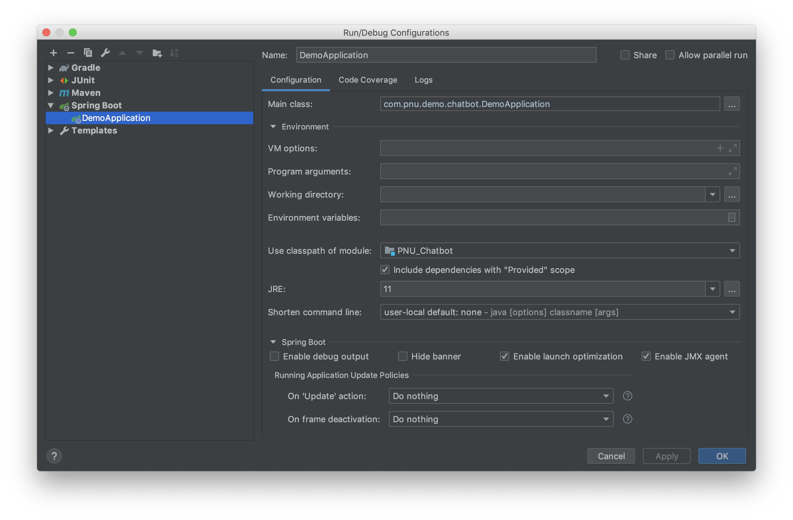

# PNU_Chatbot

부산대 관련 여러 정보를 제공해주는 챗봇입니다.

> 언제든지 아래 내용을 추가 혹은 변경할 수 있습니다.

## 시스템 구성도

> **정보관리모듈**: <br>
파싱(선택적), 스캐줄링, DB접근, 데이터가공등의 기능을 수행하는 모듈


## 로컬에서 실행 (on IntelliJ)

IntelliJ에서 다음과같이 빌드 설정을 하고 실행을 시키면 로컬에서 서버가 실행된다.<br>
(참고로 SpringBoot 설정은 IntelliJ의 Ultimate 버전에서만 사용할 수 있다.)




## 서버에서 실행

### 1. Artifacts 설정 (on IntelliJ)
(최초 한번 수행. 이 프로젝트는 이미 수행되어 있음.)

1. WebInitializer 클래스 만들기
```java
package com.pnu.demo.chatbot;

import org.springframework.boot.builder.SpringApplicationBuilder;
import org.springframework.boot.web.servlet.support.SpringBootServletInitializer;

public class WebInitializer extends SpringBootServletInitializer {
    @Override
    protected SpringApplicationBuilder configure(SpringApplicationBuilder application) {
        return application.sources(DemoApplication.class);
    }
}
```

2. `pom.xml`에 적절한 properties, dependency 추가
```xml
<properties>
    <start-class>com.pnu.demo.chatbot.DemoApplication</start-class>
</properties>

<dependencies>
    <!-- to deploy as a war in tomcat -->
    <dependency>
        <groupId>org.springframework.boot</groupId>
        <artifactId>spring-boot-starter-tomcat</artifactId>
        <scope>provided</scope>
    </dependency>
		<!-- ... -->
</dependencies>
```


### 2. war 파일 만들기 (on IntelliJ)

`Build` → `Build Artifacts` → `PROJECT_NAME:war → Build` 선택하여 war 파일 생성

### 3. tomcat 설치 및 실행 (on Server)

[How to Install Apache Tomcat 9 (on Windows, Mac OS X, Ubuntu) and Get Started with Java Servlet Programming](https://www.ntu.edu.sg/home/ehchua/programming/howto/Tomcat_HowTo.html)

### 4. 배포 (on Server)

서버의 `opt/tomcat/webapps/` 경로에 생성된 `{}.war` 파일을 업로드하면 자동으로 갱신된다.


## Packages

### NLP
자연어로 이루어진 텍스트를 입력으로 받으면 `행동(Action)`과 `대상(Target)`을 카테고리로 분류하여 반환한다.

```
- TextClassifier.java: 자연어 텍스트를 입력으로 받으면 카테고리를 분류하여 반환
```

### DialogFlow 

1. [DialogFlow 홈페이지](https://dialogflow.com/)
2. [DialogFlow 문서](https://dialogflow.com/docs)
