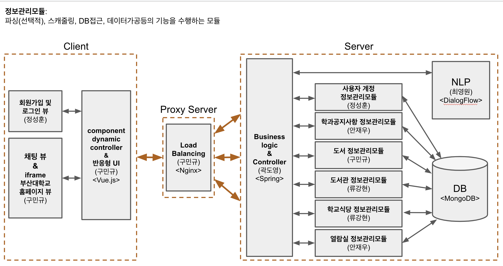

# PNU_Chatbot

부산대 관련 여러 정보를 제공해주는 챗봇입니다.

> 언제든지 아래 내용을 추가 혹은 변경할 수 있습니다.

## 시스템 구성도

> **정보관리모듈**: <br>
파싱(선택적), 스캐줄링, DB접근, 데이터가공등의 기능을 수행하는 모듈



## Packages

### NLP
자연어로 이루어진 텍스트를 입력으로 받으면 `행동(Action)`과 `대상(Target)`을 카테고리로 분류하여 반환한다.

```
- TextClassifier.java: 자연어 텍스트를 입력으로 받으면 카테고리를 분류하여 반환
```

### DialogFlow 

1. [DialogFlow 홈페이지](https://dialogflow.com/)
2. [DialogFlow 문서](https://dialogflow.com/docs)
